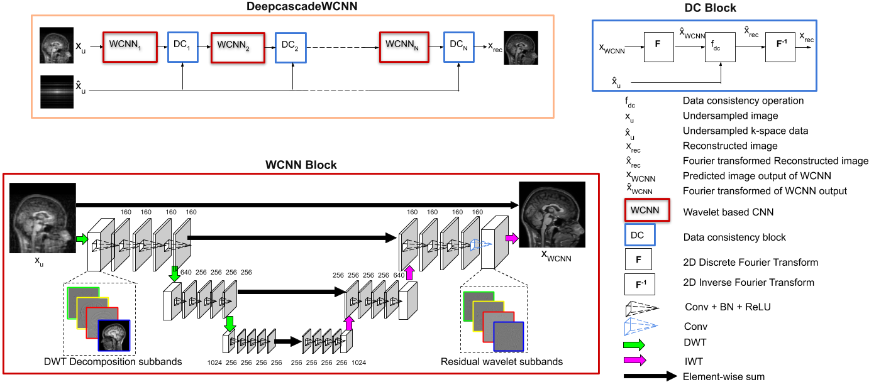

# DC-WCNN-Wavelet-baed-CNN
### *Wavelet-based encoder decoder architecture for MRI Reconstruction* 
> [DC-WCNN: A Deep Cascade Of Wavelet based Convolutional Neural Networks For MR Image Reconstruction](https://arxiv.org/abs/2001.02397) (ISBI 2020) 


## Dependencies
#### Packages
* *PyTorch*
* *TensorboardX*
* *OpenCV*
* *numpy*
* *tqdm*
 
An exhaustive list of packages used could be found in the *requirements.txt* file. Install the same using the following command:

```bash
 conda create --name <env> --file requirements.txt
```

## Train code 

```bash
sh train_kirby.sh
```

## Test code 

```bash
sh valid_kirby.sh
```

## Evaluate PSNR / SSIM metrics 

```bash
sh evaluate_kirby.sh
```

## Display PSNR / SSIM metrics 

```bash
sh report_collect_kirby.sh
```

 ## Citations
If you use the DC-WCNN in your research, please consider citing:
```
@article{sriprabha-dc-wcnn-2020,
  title={DC-WCNN: A Deep Cascade Of Wavelet based Convolutional Neural Networks For MR Image Reconstruction},
  author={Sriprabha Ramanarayanan, Balamurali Murugesan, Keerthi Ram and Mohanasankar Sivaprakasam},
  journal={ArXiv},
  year={2020},
  volume={abs/2001.02397}
}
```